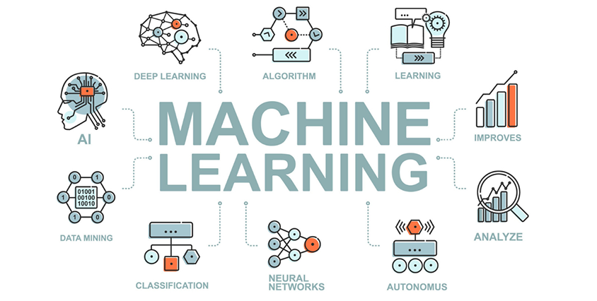
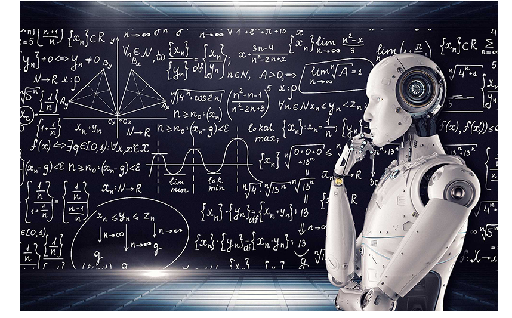

# Machine Learning 

## Introdution
Welcome to my Machine Learning responsitory! In this responsitory, I share my learning journey throuth various Machine Learning concepts, including theoretical resources, pratical exercies, and solutions.

  

  
</div

## How to use

You can navigate through the folders to explore:

  1. Materials: Includes links and references and tutorials.
  2. Exercises: A collection of problems to test and sharpen your skills.
  3. Solutions: step-by-step solutions to the exercises with explanations. 